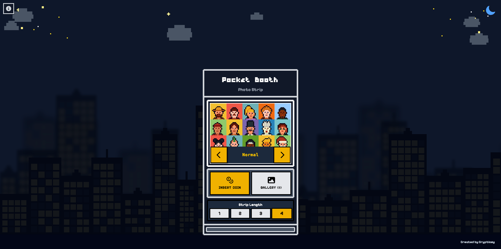

# Pocket Booth

<p style="text-align: justify;"> Pocket Booth is like having a tiny photo booth right in your pocket. Snap instant photo strips, relive the fun of those classic photo booths, and keep your memories safe - all stored locally on your device. </p> 

<br/> 

<div align="center" style="flex-direction: column;">
   
   <div style="font-size: 0.8em; color: gray;">Home Screen</div>
</div> 

<br/> 

<p style="text-align: justify;"> Built with React, TypeScript, and Tailwind, Pocket Booth lets you capture photo strips, preview them in real-time, and save them directly to your device. A little digital nostalgia, instantly available anytime, without the hassle of a real one. </p>
<br/>

### Quick Start

#### Prerequisites

- Node.js 18+
- npm or yarn
- Modern browser with camera support

#### Option 1: Basic Deployment (GitHub Pages Only)
**Free hosting with local browser storage only**

```bash
# Install dependencies
yarn install

# Build and deploy to GitHub Pages
yarn deploy
```

This deploys only the frontend. Photos are stored in browser's localStorage.

#### Option 2: Full Deployment (GitHub Pages + Vercel)
**With Google Drive cloud upload support**

1. **Deploy Frontend to GitHub Pages:**
   ```bash
   yarn deploy
   ```

2. **Deploy Backend to Vercel:**
   - Create project in Vercel dashboard
   - Download OAuth JSON from Google Cloud Console
   - Set `GOOGLE_OAUTH_CREDENTIALS` environment variable
   - **Note**: Vercel deployment is manual via their web dashboard

3. **Connect Frontend to Backend:**
   - Create `.env.production` locally (gitignored, won't be committed)
   - Add: `VITE_VERCEL_API_URL=https://your-vercel-url.vercel.app`
   - Redeploy frontend: `yarn deploy`

📖 **Full guide**: [DEPLOYMENT.md](./DEPLOYMENT.md)

<br/>

### Local Development

```bash
yarn install
yarn dev
```

Visit `http://localhost:5173`

<br/>

### Usage Modes

Pocket Booth supports two modes:

#### 1. **Normal Mode (No Key)**
Access: `https://yoursite.com/pocket-booth/`

- ✅ Unlimited photos
- ✅ Download photos locally
- ❌ No Google Drive upload
- ❌ No photo limits

Perfect for personal use or casual photo booth sessions.

#### 2. **Key-Based Mode (With Valid Key)**
Access: `https://yoursite.com/pocket-booth/?key=wedding`

- ✅ Photo limits enforced (configurable per key)
- ✅ Google Drive upload enabled
- ✅ Photos tracked in localStorage per key
- ✅ Access blocked when limit reached

Perfect for events with controlled photo counts.


**How it works:**
- User opens the app with a `?key=` parameter in the URL
- App validates the key against environment variables (e.g., `VITE_CONFIG_WEDDING`)
- If key is valid:
  - Photo limit is enforced using localStorage
  - Google Drive upload button appears
  - Access is blocked when limit is reached (button disabled + redirect)
- If key is invalid or missing:
  - Normal mode with unlimited photos
  - No Google Drive upload

<br/>

### Architecture

#### Basic Setup (GitHub Pages Only)
```
┌─────────────────┐
│  GitHub Pages   │  Static website hosting (free)
│   (Frontend)    │  - React + Vite
└────────┬────────┘  - Camera API
         │
         │ localStorage
         ▼
┌─────────────────┐
│  Browser        │  Local storage
│  localStorage   │  - Photo strips (base64)
└─────────────────┘  - Gallery data
                     - Photo count per key
```

#### Full Setup (with Google Drive Upload)
```
┌─────────────────┐
│  GitHub Pages   │  Frontend (React + Vite)
│   (Frontend)    │  - Camera API
└────────┬────────┘  - Photo capture
         │
         │ API Calls
         ▼
┌─────────────────┐
│     Vercel      │  Backend (Python Flask)
│   (Backend)     │  - OAuth 2.0 flow
└────────┬────────┘  - Photo upload API
         │
         │ Google Drive API
         ▼
┌─────────────────┐
│  Google Drive   │  Cloud storage
│                 │  - Photo backup
└─────────────────┘  - 24hr OAuth sessions
```

<br/>